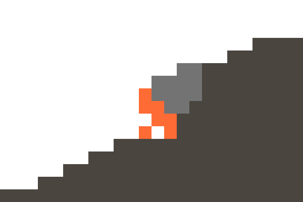

||
|-:|
<!-- Aquí irán los repositorios que me indiques -->
 

<i>"Sé tu propia lámpara" - <b>Buda</b></i>

# Bryan Baquedano

*«Hola, me llamo Bryan Baquedano. Soy estudiante de Ingeniería Informática originario de Honduras. A través de mis estudios, busco entrelazar el diseño y la tecnología para dar vida a experiencias intuitivas. Más allá de las líneas de código y la lógica, encuentro profunda fascinación e inspiración entre las páginas de la historia, la filosofía y la literatura.»*

 
⁂
  

##  Contacto
  

